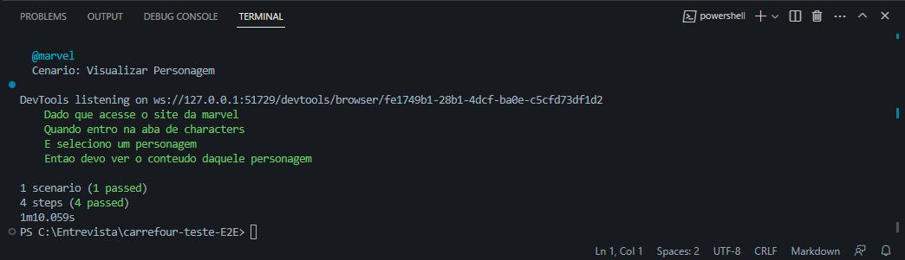
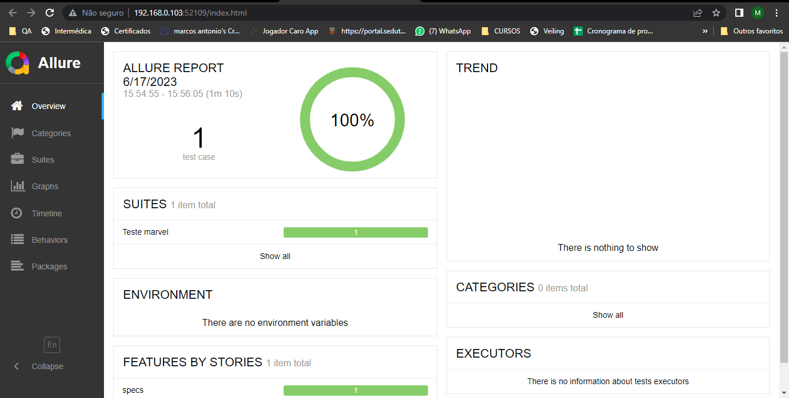
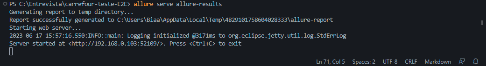

# Projeto de Automação Marvel

## carrefour-teste-E2E
Testes realizados E2E - Utilizando Ruby - Cucumber - Capybara

## Carrefour Processo Seletivo QA - Teste Automação Complementar - Bônus 
Teste Processo Seletivo QA - Carrefour

## Guia de instalação
- Todo o código do projeto se encontra no repositório
- Como terminal utilizei o Hyper

1. Dependências Globais
    * Instalar o [Ruby + Devkit] link para download =>(https://rubyinstaller.org/downloads/)
    - Recomendo utilizar a versão 3.2.2

2. Dependências
    * Instalar Bundler
    - Bundler é o gerenciador de gemas do Ruby, oferece um ambiente consistente para o gerenciamento e instalação das dependencias do projeto.
    
    $ gem install bundler
    

2. Dependências do Projeto
	* Instalar as gems
	
	$ bundle install
	

3. Instalando os driver dos navegadores
	* Dentro da pasta raíz executar o script webdriver.rb
	* Será baixado a versão mais atual do chromedriver e geckodriver, ou seja é necessário realizar o update dos navegadores utilizados.
    
	$ ruby .\webdrivers\
  
    

### Executar Testes
  1. Ao baixar o projeto será necessario instalar o webdriver, basta utilizar o codigo abaixo, que será criado uma pasta webdrivers na raiz com as configurações do seu navegador
  
  $ ruby webdrivers.rb

  2. Executando todos os testes
    
	$ cucumber
  
  
    
  
  3. Executando um cenário específico usando a tag
    
	$ cucumber -t "@marvel"

  
  4. Instalando Allure
  
    * Recomendo utilizar a versão 1.8 ou superior do java

	$ npm install -g allure-commandline --save-dev (Nesse caso precisa ter o node.js instalado no computador)

    O Allure ele basicamente encapsula informações coletadas no teste, e gera um relatorio muito completinho

  
  5. Exibindo o relatorio de testes

    $ allure serve allure-results

    
    